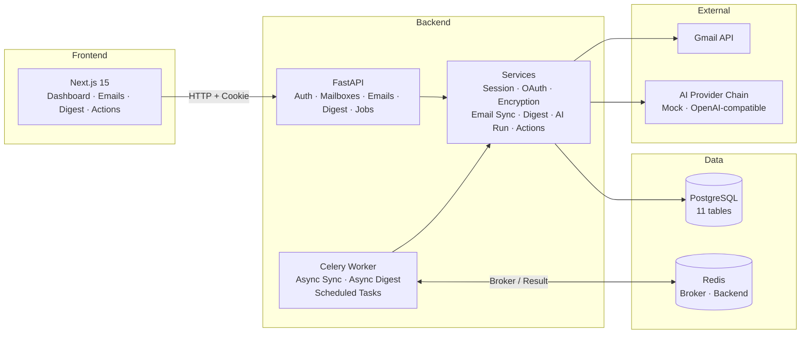

<div align="center">

# MailMind

**Your inbox, distilled into decisions.**

MailMind is a local-first AI email copilot that turns multi-mailbox overload into an actionable Daily Digest.

It is not another inbox client. It is an **AI decision layer** for your email.

<br />


<br />

<!-- TODO: Replace with real screenshot -->
<!--  -->

> Dashboard preview screenshot coming soon.

</div>

---

## Why MailMind

Email inboxes are designed for volume, not decisions. You get hundreds of messages a day, but only a handful actually require action.

MailMind sits on top of your Gmail and answers one question:

> **What should I do today?**

It syncs your email, runs it through an AI pipeline, and produces a structured Daily Digest with prioritized items, suggested actions, and deadlines — not just another inbox view.

---

## Current Capabilities

### ✅ Done

**Auth & Identity**
- User registration, login, logout, and session check (`GET /api/auth/me`)
- HttpOnly cookie-backed sessions persisted in `sessions` table

**Gmail Integration**
- Gmail OAuth login / callback / disconnect
- Encrypted refresh-token storage in `mailbox_credentials`
- Mailbox connected state and reauthorization management
- Manual "Sync Today" and async sync jobs
- Email list with search, read-state filters, date filters, and pagination
- Email detail with read/unread writeback to Gmail

**Provider Mailbox Foundation (v0.5 candidate)**
- Provider-aware mailbox contract with `gmail`, `imap`, and `outlook` keys
- Mailbox capabilities returned by mailbox list/detail APIs
- Gmail migrated behind the `MailboxProvider` abstraction
- IMAP Provider MVP with encrypted password storage, mocked provider tests, and real connect API
- Outlook provider skeleton and contract; no fake Outlook connect UI
- Mailbox provider badges and mailbox filter on `/emails`

**Daily Digest & AI**
- Digest generation and refresh (synchronous + async job endpoints)
- Digest scope selector with `All Mailboxes` and single-mailbox views
- All-mailboxes digest with priority queue plus grouped mailbox summaries
- Mock AI provider for local development (no paid API calls needed)
- OpenAI-compatible provider chain via environment configuration
- `ai_runs` audit trail for provider/model metadata and output traceability
- `digest_items` as parsed, structured business state
- Digest item actions: `mark-done`, `dismiss`, `snooze`

**Background Jobs (v0.3)**
- Celery worker with Redis broker and result backend
- Job Status API: `GET /api/jobs`, `GET /api/jobs/{job_id}`, `POST /api/jobs/{job_id}/retry`
- Async mail sync, digest generate, and digest refresh job endpoints
- Job retry / failure handling with `max_retries = 3` and error redaction
- Scheduled email sync and scheduled digest foundation tasks

**Job Experience (v0.4)**
- Frontend Job API client with typed routes and polling hooks
- Real-time job status, progress, error, and retry UI components
- Async mailbox sync with polling and synchronous fallback
- Async digest generate/refresh with polling and synchronous fallback
- Recent jobs / background activity display on `/actions`
- i18n coverage for job-related UI (English and Chinese)
- Theme-compatible job components using existing design tokens
- Accessible progress bars and retry buttons

**Config Sync Containment (v0.4.1)**
- Local config loading from `backend/.env.local` and `frontend/.env.local`
- Shared Settings object between FastAPI and Celery worker
- Duplicate sync job prevention with Redis per-mailbox lock
- Retry with exponential backoff and jitter for network failures
- Frontend job trigger hardening (disable buttons during active jobs)
- Development scripts for backend, worker, frontend, and all-in-one startup

**Frontend**
- Next.js 15 dashboard-first design with TypeScript and ESLint
- 4 themes: Amber Focus, Noir Pulse, Paper Calm, Dense Minimal
- i18n foundation with English and Chinese language resources
- Avatar account menu with sign-out
- Digest dashboard with generate/refresh controls and mailbox scope selector
- Action history page with filters and pagination
- Mailbox settings with Gmail connection, disconnect, and sync

### 🧭 Planned

- Full Outlook OAuth provider implementation
- In-app AI provider settings UI
- Celery Beat for automated scheduling
- Production deployment and Google OAuth verification

---

## Architecture



---

## AI Pipeline Highlights

MailMind's AI layer is designed for traceability, not just output.

| Feature | Status | Description |
|---------|--------|-------------|
| Provider abstraction | ✅ Done | Unified interface for mock and real providers |
| Mock provider | ✅ Done | Zero-cost local development without paid API calls |
| OpenAI-compatible chain | ✅ Done | Environment-configured multi-provider fallback |
| `ai_runs` traceability | ✅ Done | Records provider, model, prompt version, output hash |
| Parsed digest items | ✅ Done | Structured `digest_items` instead of ephemeral model text |
| Prompt versioning | ✅ Done | Schema and prompt version metadata per run |
| Error redaction | ✅ Done | Tokens, keys, and raw prompts never leak to logs or API |
| In-app provider UI | 🧭 Planned | AI provider management through the frontend |

---

## Tech Stack

| Layer | Technology |
|-------|-----------|
| Frontend | Next.js 15, React 19, TypeScript, plain CSS theme tokens |
| Backend | FastAPI, SQLAlchemy 2, Alembic, Pydantic Settings, Celery |
| Database | PostgreSQL 15 |
| Cache / Broker | Redis |
| AI | Mock provider + OpenAI-compatible provider chain |
| Email | Gmail API + IMAP via provider adapters |
| Infra | Docker Compose, `uv` (Python), npm |

---

## Quick Start

Run MailMind locally in a few minutes.

### 1. Start infrastructure

```bash
docker compose -f docker/docker-compose.yml up -d postgres redis
```

### 2. Configure environment

```bash
cp .env.example .env
# Edit .env with your local values (APP_ENCRYPTION_KEY, GOOGLE_CLIENT_ID, etc.)
```

### 3. Start backend

```bash
cd backend
uv sync
uv run alembic upgrade head
uv run uvicorn app.main:app --reload --host 127.0.0.1 --port 8000
```

### 4. Start Celery worker (for async jobs)

```bash
cd backend
uv run celery -A app.jobs.celery_app worker --loglevel=info --pool=solo
```

### 5. Start frontend

```bash
cd frontend
npm install
npm run dev
```

### 6. Open MailMind

Open [http://localhost:3000](http://localhost:3000) in your browser.

---

## Local Development

### Prerequisites

- Python 3.11+
- `uv`
- Node.js compatible with Next.js 15
- npm
- Docker Desktop or equivalent

### Environment

Copy `.env.example` to `.env` and fill in local values. **Never commit `.env`.**

Key variables:

| Variable | Purpose |
|----------|---------|
| `APP_SECRET_KEY` | Session signing secret |
| `APP_ENCRYPTION_KEY` | Encrypts stored Gmail refresh tokens |
| `DATABASE_URL` | PostgreSQL connection URL |
| `REDIS_URL` | Redis URL for Celery broker |
| `GOOGLE_CLIENT_ID` | Google OAuth client ID |
| `GOOGLE_CLIENT_SECRET` | Google OAuth client secret |
| `GOOGLE_REDIRECT_URI` | Usually `http://localhost:8000/api/auth/gmail/callback` |
| `AI_PROVIDER_MODE` | Set `env` for real providers; empty for mock fallback |
| `AI_PROVIDER_<ID>_API_KEY` | Per-provider API key |

### Google OAuth Setup

Configure a Google OAuth app with redirect URI:

```text
http://localhost:8000/api/auth/gmail/callback
```

Required scopes: `gmail.readonly` (sync), `gmail.modify` (read/unread writeback).

### Verification

```bash
# Backend
cd backend
uv run pytest
uv run python -m compileall app tests

# Frontend
cd frontend
npm run typecheck
npm run lint
npm run build
```

---

## Roadmap

### ✅ Completed

| Version | Scope |
|---------|-------|
| v0.1 Local MVP | Auth, Gmail OAuth, email sync, mock digest, frontend preview |
| v0.2 Digest AI | Real AI provider chain, digest dashboard, action history, email UX |
| v0.3 Async Redesign | Celery workers, job API, scheduled tasks, theme redesign, i18n |
| v0.4 Job Experience | Frontend job UI, async sync/digest experience, retry, recent jobs |
| v0.4.1 Config Sync Containment | Local config hardening, duplicate job prevention, retry backoff, frontend trigger hardening |

### 🧭 Next

| Version | Scope |
|---------|-------|
| v0.5 Open Source Ready | CI, Docker polish, public docs review |
| v1.0 Personal Productivity | Stable daily driver for personal email management |

---

## Security Notes

- **Local-first**: All data stays on your machine. No cloud sync, no telemetry.
- **Encrypted credentials**: Gmail refresh tokens are encrypted at rest with `APP_ENCRYPTION_KEY`.
- **HttpOnly sessions**: Session cookies are HttpOnly; no client-side token access.
- **Error redaction**: Job errors are sanitized before storage and API response. Tokens, keys, and raw prompts never leak.
- **Gmail restricted scopes**: `gmail.modify` requires Google review before public distribution. This is a local MVP, not a production SaaS.

> **Warning**: If `APP_ENCRYPTION_KEY` is lost, existing encrypted Gmail refresh tokens cannot be decrypted. Reconnect Gmail to recover.

---

## Documentation

| Document | Path |
|----------|------|
| Product Requirements | `docs/product/PRD.md` |
| System Design | `docs/architecture/SYSTEM_DESIGN.md` |
| Database Design | `docs/database/DATABASE_DESIGN.md` |
| API Design | `docs/api/API_DESIGN.md` |
| AI Pipeline | `docs/ai/AI_PIPELINE.md` |
| Security Model | `docs/security/SECURITY.md` |
| Frontend Design | `docs/frontend/FRONTEND_DESIGN.md` |
| Task Breakdown | `docs/engineering/TASK_BREAKDOWN.md` |
| Local Development | `docs/engineering/LOCAL_DEVELOPMENT.md` |
| v0.3 Release Notes | `docs/release-notes/v0.3.0-async-redesign.md` |
| v0.4 Release Notes | `docs/release-notes/v0.4.0-job-experience.md` |
| v0.4.1 Release Notes | `docs/release-notes/v0.4.1-config-sync-containment.md` |

---

## License

Apache-2.0

---

<div align="center">

**v0.4.1-config-sync-containment** · Local MVP · Not a production SaaS

[Release Notes](docs/release-notes/v0.4.1-config-sync-containment.md) · [Roadmap](docs/ROADMAP.md) · [API Docs](docs/api/CURRENT_API_SUMMARY.md)

</div>
