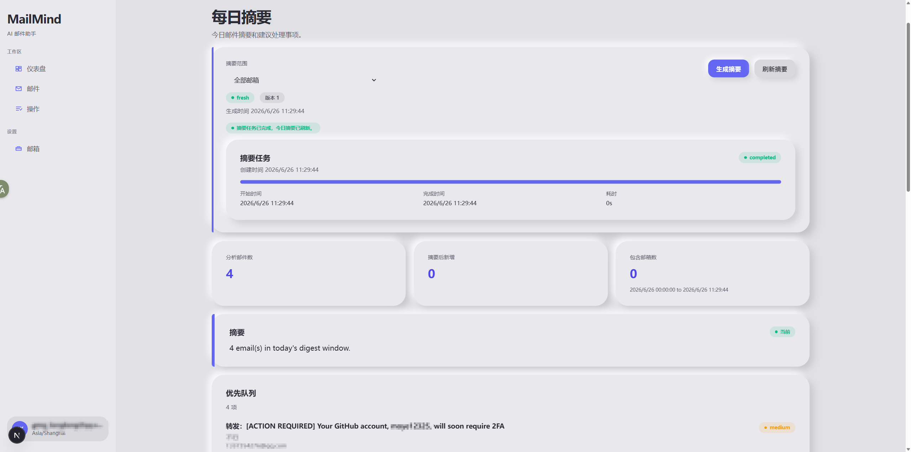
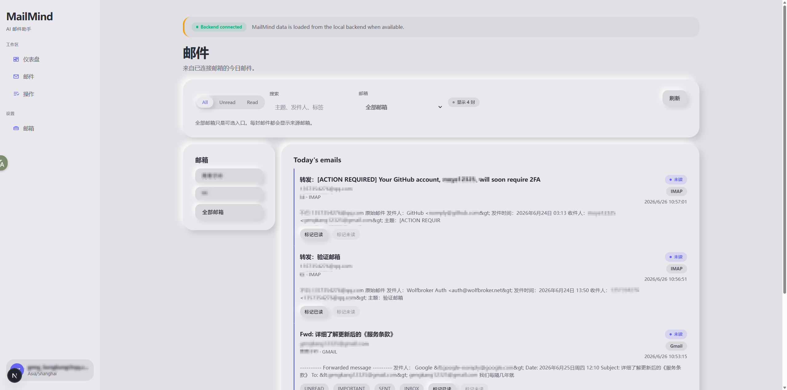
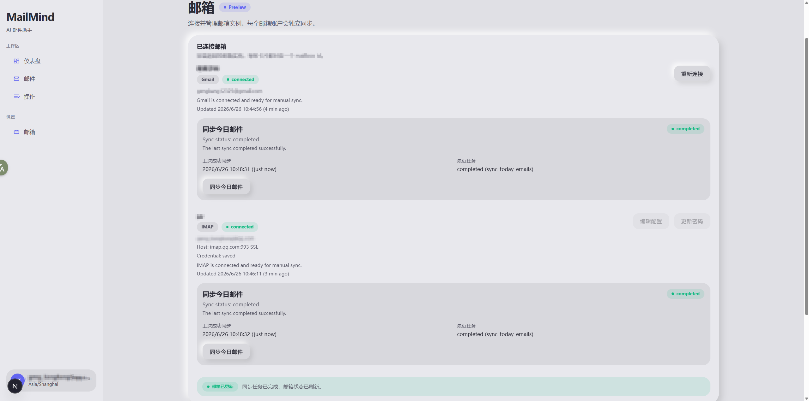
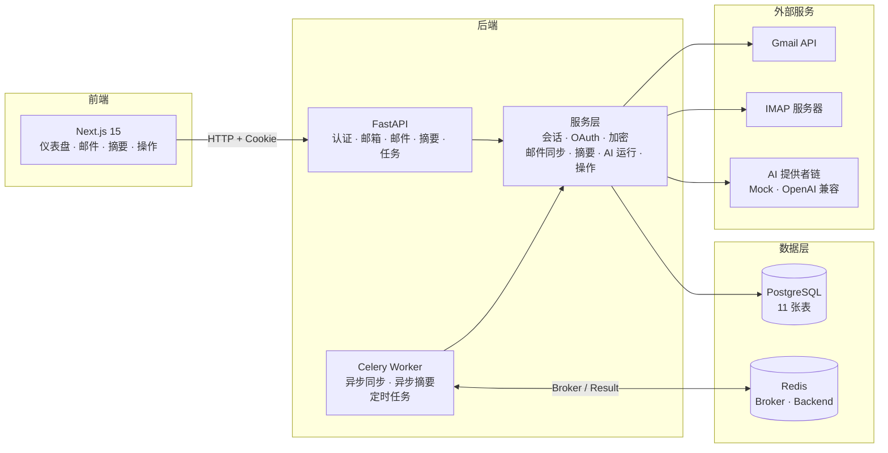

<div align="right">

[English](README.md) | **简体中文**

</div>

<div align="center">


<br />

MailMind 是一款本地优先的多邮箱 AI 邮件助手，支持 Gmail 和 IMAP。
它将收件箱的海量信息转化为可执行的每日摘要 —— 按紧急程度排序，按置信度评分，助你快速决策。

<br />


<br />



<br />



<br />



<br />

<sub>每日摘要 · 邮件列表 · 邮箱管理 · 6 种主题，支持明暗模式</sub>

</div>

---

## 为什么选择 MailMind

收件箱的设计是为了承载容量，而不是帮助决策。你每天收到数百封邮件，但只有少数几封真正需要处理。

MailMind 连接你的 Gmail 和 IMAP 账户，只回答一个问题：

> **今天我该做什么？**

它同步你的邮件，通过 AI 管道处理，生成结构化的每日摘要 —— 包含优先级排序的任务项、建议操作和截止日期 —— 不只是另一个收件箱视图。

---

## 核心功能

### ✅ 已完成

**认证与身份**
- 用户注册、登录、登出和会话检查（`GET /api/auth/me`）
- HttpOnly Cookie 会话，持久化存储于 `sessions` 表

**Gmail 集成**
- Gmail OAuth 登录 / 回调 / 断开连接
- 加密存储刷新令牌于 `mailbox_credentials`
- 邮箱连接状态和重新授权管理
- 手动"同步今日"和异步同步任务
- 邮件列表：搜索、已读过滤、日期过滤、分页
- 邮件详情：已读/未读状态回写 Gmail

**多邮箱提供者架构 (v0.5)**
- 提供者感知的邮箱协议，支持 `gmail`、`imap`、`outlook`
- 邮箱列表/详情 API 返回提供者能力
- Gmail 已迁移至 `MailboxProvider` 抽象层
- IMAP 提供者 MVP：加密密码存储、模拟测试、真实连接 API
- Outlook 提供者骨架和协议（无虚假连接 UI）
- 邮箱提供者徽章和 `/emails` 页面的邮箱筛选

**每日摘要与 AI**
- 摘要生成和刷新（同步 + 异步任务端点）
- 摘要范围选择器：`所有邮箱` 和单邮箱视图
- 全邮箱摘要：优先级队列 + 分组邮箱摘要
- 本地开发用 Mock AI 提供者（无需付费 API 调用）
- 环境配置的 OpenAI 兼容提供者链
- `ai_runs` 审计追踪：提供者/模型/提示词版本/输出哈希
- `digest_items` 结构化业务状态（非临时模型文本）
- 摘要项操作：`标记完成`、`忽略`、`稍后处理`

**后台任务 (v0.3)**
- Celery Worker + Redis Broker + Result Backend
- 任务状态 API：`GET /api/jobs`、`GET /api/jobs/{job_id}`、`POST /api/jobs/{job_id}/retry`
- 异步邮件同步、摘要生成、摘要刷新任务端点
- 任务重试/失败处理：`max_retries = 3`，错误信息脱敏
- 定时邮件同步和定时摘要基础任务

**任务体验 (v0.4)**
- 前端任务 API 客户端：类型化路由和轮询 Hooks
- 实时任务状态、进度、错误和重试 UI 组件
- 异步邮箱同步：轮询 + 同步回退
- 异步摘要生成/刷新：轮询 + 同步回退
- `/actions` 页面显示最近任务/后台活动
- 任务相关 UI 的 i18n 支持（中英文）
- 主题兼容的任务组件，使用现有设计令牌
- 可访问的进度条和重试按钮

**配置同步治理 (v0.4.1)**
- 本地配置加载：`backend/.env.local` 和 `frontend/.env.local`
- FastAPI 和 Celery Worker 共享 Settings 对象
- Redis 邮箱级锁防止重复同步任务
- 指数退避 + 抖动重试网络失败
- 前端任务触发加固（活跃任务期间禁用按钮）
- 开发脚本：后端、Worker、前端、一键启动

**前端**
- Next.js 15 仪表盘优先设计，TypeScript + ESLint
- 6 种主题预设，完整明暗模式：Neon Cyber、Glass Aurora、Gradient Flow、Soft Clay、Noir Pulse、Dense Minimal
- 预水合主题应用 —— 无未样式化内容闪烁
- i18n 基础设施，支持中英文
- 头像账户菜单，支持登出
- 摘要仪表盘：生成/刷新控制 + 邮箱范围选择器
- 操作历史页面：筛选和分页
- 邮箱设置：Gmail 连接、断开、同步

**UI/UX 打磨 (v0.5.1)**
- CSS 动画视觉特效（fadeSlideUp、pulseGlow、neonFlicker）
- 响应式设计：780px 断点侧边栏折叠
- 主题切换支持 `prefers-reduced-motion`
- Playwright 验证截图覆盖全部 12 种主题/模式组合

### 🧭 计划中

- 完整的 Outlook OAuth 提供者实现
- 应用内 AI 提供者设置 UI
- Celery Beat 自动化调度
- 生产部署和 Google OAuth 验证

---

## 系统架构



> **详细架构图：** 参见 [`docs/architecture/DIAGRAMS.md`](docs/architecture/DIAGRAMS.md)，包含 6 张渲染架构图：系统上下文、提供者/邮箱架构、Celery 任务调度序列、摘要范围流程、数据模型 ERD、前端架构。

---

## AI 管道亮点

MailMind 的 AI 层设计注重可追溯性，而不仅仅是输出。

| 特性 | 状态 | 说明 |
|------|------|------|
| 提供者抽象 | ✅ 完成 | Mock 和真实提供者的统一接口 |
| Mock 提供者 | ✅ 完成 | 零成本本地开发，无需付费 API 调用 |
| OpenAI 兼容链 | ✅ 完成 | 环境配置的多提供者回退 |
| `ai_runs` 可追溯性 | ✅ 完成 | 记录提供者、模型、提示词版本、输出哈希 |
| 结构化摘要项 | ✅ 完成 | 结构化 `digest_items` 替代临时模型文本 |
| 提示词版本化 | ✅ 完成 | 每次运行的 Schema 和提示词版本元数据 |
| 错误脱敏 | ✅ 完成 | Token、密钥和原始提示词不会泄露到日志或 API |
| 防御性 LLM 解析 | ✅ 完成 | 处理畸形 JSON、别名枚举、缺失字段 |
| 应用内提供者 UI | 🧭 计划中 | 通过前端管理 AI 提供者 |

---

## 技术栈

| 层级 | 技术 |
|------|------|
| 前端 | Next.js 15、React 19、TypeScript、纯 CSS 主题令牌 |
| 后端 | FastAPI、SQLAlchemy 2、Alembic、Pydantic Settings、Celery |
| 数据库 | PostgreSQL 15 |
| 缓存 / Broker | Redis |
| AI | Mock 提供者 + OpenAI 兼容提供者链 |
| 邮件 | Gmail API + IMAP 提供者适配器 |
| 基础设施 | Docker Compose、`uv` (Python)、npm |

---

## 快速开始

几分钟内本地运行 MailMind。

### 1. 启动基础设施

```bash
docker compose -f docker/docker-compose.yml up -d postgres redis
```

### 2. 配置环境变量

```bash
cp .env.example .env
# 编辑 .env 填入本地值（APP_ENCRYPTION_KEY、GOOGLE_CLIENT_ID 等）
```

### 3. 启动后端

```bash
cd backend
uv sync
uv run alembic upgrade head
uv run uvicorn app.main:app --reload --host 127.0.0.1 --port 8000
```

### 4. 启动 Celery Worker（异步任务）

```bash
cd backend
uv run celery -A app.jobs.celery_app worker --loglevel=info --pool=solo
```

### 5. 启动前端

```bash
cd frontend
npm install
npm run dev
```

### 6. 打开 MailMind

在浏览器中访问 [http://localhost:3000](http://localhost:3000)。

---

## 本地开发

### 环境要求

- Python 3.11+
- `uv`
- 兼容 Next.js 15 的 Node.js
- npm
- Docker Desktop 或等效工具

### 环境变量

复制 `.env.example` 为 `.env` 并填入本地值。**切勿提交 `.env`。**

关键变量：

| 变量 | 用途 |
|------|------|
| `APP_SECRET_KEY` | 会话签名密钥 |
| `APP_ENCRYPTION_KEY` | 加密存储的 Gmail 刷新令牌 |
| `DATABASE_URL` | PostgreSQL 连接 URL |
| `REDIS_URL` | Redis URL，用于 Celery Broker |
| `GOOGLE_CLIENT_ID` | Google OAuth 客户端 ID |
| `GOOGLE_CLIENT_SECRET` | Google OAuth 客户端密钥 |
| `GOOGLE_REDIRECT_URI` | 通常为 `http://localhost:8000/api/auth/gmail/callback` |
| `AI_PROVIDER_MODE` | 设为 `env` 使用真实提供者；留空使用 Mock 回退 |
| `AI_PROVIDER_<ID>_API_KEY` | 每个提供者的 API 密钥 |

### Google OAuth 配置

配置 Google OAuth 应用，重定向 URI：

```text
http://localhost:8000/api/auth/gmail/callback
```

所需权限范围：`gmail.readonly`（同步）、`gmail.modify`（已读/未读回写）。

### 验证

```bash
# 后端
cd backend
uv run pytest
uv run python -m compileall app tests

# 前端
cd frontend
npm run typecheck
npm run lint
npm run build
```

---

## 路线图

### ✅ 已完成

| 版本 | 范围 |
|------|------|
| v0.1 本地 MVP | 认证、Gmail OAuth、邮件同步、Mock 摘要、前端预览 |
| v0.2 摘要 AI | 真实 AI 提供者链、摘要仪表盘、操作历史、邮件体验 |
| v0.3 异步重构 | Celery Worker、任务 API、定时任务、主题重设计、i18n |
| v0.4 任务体验 | 前端任务 UI、异步同步/摘要体验、重试、最近任务 |
| v0.4.1 配置同步治理 | 本地配置加固、重复任务防止、重试退避、前端触发加固 |
| v0.5 提供者邮箱基础 | 多邮箱支持、IMAP 提供者 MVP、Celery 可靠性、摘要范围 |
| v0.5.1 UI/UX 打磨 | 6 种主题预设、明暗模式、视觉特效、Playwright 验证 |
| v0.5.2 Demo 就绪 | 架构图、Demo 脚本、项目导览、文档刷新 |

### 🧭 下一步

| 版本 | 范围 |
|------|------|
| v0.6 开源就绪 | CI、Docker 打磨、公开文档审查 |
| v1.0 个人效率 | 稳定的个人邮件管理日常工具 |

---

## 安全说明

- **本地优先**：所有数据留在你的机器上。无云同步，无遥测。
- **加密凭据**：Gmail 刷新令牌使用 `APP_ENCRYPTION_KEY` 静态加密。
- **HttpOnly 会话**：会话 Cookie 为 HttpOnly，客户端无法访问 Token。
- **错误脱敏**：任务错误在存储和 API 响应前已脱敏。Token、密钥和原始提示词不会泄露。
- **Gmail 受限权限**：`gmail.modify` 在公开发布前需要 Google 审核。这是本地 MVP，不是生产 SaaS。

> **警告**：如果 `APP_ENCRYPTION_KEY` 丢失，已加密的 Gmail 刷新令牌将无法解密。重新连接 Gmail 即可恢复。

---

## 文档

| 文档 | 路径 |
|------|------|
| 产品需求 | [`docs/product/PRD.md`](docs/product/PRD.md) |
| 系统设计 | [`docs/architecture/SYSTEM_DESIGN.md`](docs/architecture/SYSTEM_DESIGN.md) |
| 架构图 | [`docs/architecture/DIAGRAMS.md`](docs/architecture/DIAGRAMS.md) — 6 张渲染 SVG |
| 数据模型 ERD | [`docs/architecture/mermaid/05-data-model-erd.mmd`](docs/architecture/mermaid/05-data-model-erd.mmd) |
| 数据库设计 | [`docs/database/DATABASE_DESIGN.md`](docs/database/DATABASE_DESIGN.md) |
| API 设计 | [`docs/api/API_DESIGN.md`](docs/api/API_DESIGN.md) |
| AI 管道 | [`docs/ai/AI_PIPELINE.md`](docs/ai/AI_PIPELINE.md) |
| 安全模型 | [`docs/security/SECURITY.md`](docs/security/SECURITY.md) |
| 前端设计 | [`docs/frontend/FRONTEND_DESIGN.md`](docs/frontend/FRONTEND_DESIGN.md) |
| 任务分解 | [`docs/engineering/TASK_BREAKDOWN.md`](docs/engineering/TASK_BREAKDOWN.md) |
| 本地开发 | [`docs/engineering/LOCAL_DEVELOPMENT.md`](docs/engineering/LOCAL_DEVELOPMENT.md) |
| Demo 脚本 | [`docs/demo/DEMO_SCRIPT.md`](docs/demo/DEMO_SCRIPT.md) |
| 项目导览 | [`docs/portfolio/PROJECT_WALKTHROUGH.md`](docs/portfolio/PROJECT_WALKTHROUGH.md) |
| UI 打磨报告 | [`docs/ui/V051_UI_POLISH_SUMMARY.md`](docs/ui/V051_UI_POLISH_SUMMARY.md) |
| 主题修复报告 | [`docs/ui/V051_THEME_MODE_FIX_REPORT.md`](docs/ui/V051_THEME_MODE_FIX_REPORT.md) |
| v0.3 发布说明 | [`docs/release-notes/v0.3.0-async-redesign.md`](docs/release-notes/v0.3.0-async-redesign.md) |
| v0.4 发布说明 | [`docs/release-notes/v0.4.0-job-experience.md`](docs/release-notes/v0.4.0-job-experience.md) |
| v0.4.1 发布说明 | [`docs/release-notes/v0.4.1-config-sync-containment.md`](docs/release-notes/v0.4.1-config-sync-containment.md) |
| v0.5 发布说明 | [`docs/release-notes/v0.5.0-provider-mailbox-foundation.md`](docs/release-notes/v0.5.0-provider-mailbox-foundation.md) |
| v0.5.1 发布说明 | [`docs/release-notes/v0.5.1-ui-ux-polish.md`](docs/release-notes/v0.5.1-ui-ux-polish.md) |

---

## 许可证

Apache-2.0

---

<div align="center">

**v0.5.2-demo-readiness** · 本地优先 AI 邮件助手 · 多邮箱 · Gmail + IMAP

[发布说明](docs/release-notes/) · [路线图](docs/ROADMAP.md) · [架构图](docs/architecture/DIAGRAMS.md) · [Demo 脚本](docs/demo/DEMO_SCRIPT.md)

</div>
