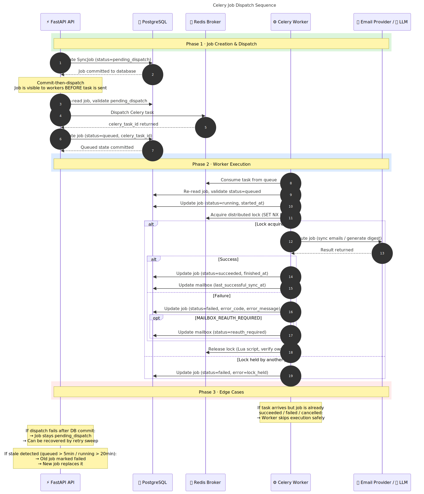

# Architecture Diagrams

MailMind's architecture visualized through Mermaid diagrams.

> **Source files:** `.mmd` files in [`mermaid/`](mermaid/) — editable in any Mermaid-compatible editor.
> **Rendered SVGs:** Pre-generated in [`diagrams/`](diagrams/) — viewable directly on GitHub.

---

## 01 · System Context

High-level view of MailMind and its external dependencies — Frontend, Backend, Workers, Data Stores, External APIs.



> Source: [`mermaid/01-system-context.mmd`](mermaid/01-system-context.mmd) · Explains: [SYSTEM_DESIGN.md](SYSTEM_DESIGN.md)

---

## 02 · Provider & Mailbox Architecture

How providers, mailboxes, credentials, and emails relate.



> Source: [`mermaid/02-provider-mailbox-architecture.mmd`](mermaid/02-provider-mailbox-architecture.mmd) · Explains: [MAILBOX_PROVIDER_ARCHITECTURE.md](MAILBOX_PROVIDER_ARCHITECTURE.md)

---

## 03 · Celery Job Dispatch Sequence

Commit-then-dispatch reliability model for background jobs — creation → dispatch → execution → completion/failure.



> Source: [`mermaid/03-celery-job-dispatch-sequence.mmd`](mermaid/03-celery-job-dispatch-sequence.mmd) · Explains: [JOB_EXECUTION_MODEL.md](JOB_EXECUTION_MODEL.md)

---

## 04 · Digest Scope Flow

How `scope_type=all` vs `scope_type=mailbox` digest generation works.



> Source: [`mermaid/04-digest-scope-flow.mmd`](mermaid/04-digest-scope-flow.mmd) · Explains: [DATA_FLOWS.md](DATA_FLOWS.md)

---

## 05 · Data Model ERD

Full PostgreSQL data model with all core tables, fields, and relationships.



> Source: [`mermaid/05-data-model-erd.mmd`](mermaid/05-data-model-erd.mmd) · Explains: [../database/DATABASE_DESIGN.md](../database/DATABASE_DESIGN.md)

---

## 06 · Frontend Architecture

Next.js App Router pages, context providers, component hierarchy, and shared hooks.



> Source: [`mermaid/06-frontend-architecture.mmd`](mermaid/06-frontend-architecture.mmd) · Explains: [../frontend/FRONTEND_DESIGN.md](../frontend/FRONTEND_DESIGN.md)

---

## How to Regenerate SVGs

### Mermaid CLI (recommended)

```bash
# Install
npm install -g @mermaid-js/mermaid-cli

# Generate single SVG
mmdc -i docs/architecture/mermaid/01-system-context.mmd -o docs/architecture/diagrams/01-system-context.svg -b transparent
```

### Batch generate all diagrams

```powershell
# From repo root
$files = Get-ChildItem docs/architecture/mermaid/*.mmd
foreach ($f in $files) {
    $name = $f.BaseName
    mmdc -i $f.FullName -o "docs/architecture/diagrams/$name.svg" -b transparent
    Write-Host "Generated: $name.svg"
}
```

### Mermaid Live Editor

1. Open [mermaid.live](https://mermaid.live)
2. Paste the contents of any `.mmd` file
3. Export as SVG or PNG

---

## Design Principles

Each diagram follows these conventions:

- **Semantic naming** — files are numbered `01-` through `06-` for logical reading order
- **Self-documenting** — each file includes a `title` and `description` frontmatter
- **Color-coded** — nodes use consistent colors across diagrams:
  - Indigo `#4f46e5` — frontend / user identity
  - Emerald `#059669` — backend services / mailbox
  - Amber `#d97706` — data stores / jobs
  - Violet `#7c3aed` — external services / digest
  - Rose `#e11d48` — dedup / actions
- **Minimal but complete** — enough detail to understand the system without overwhelming
